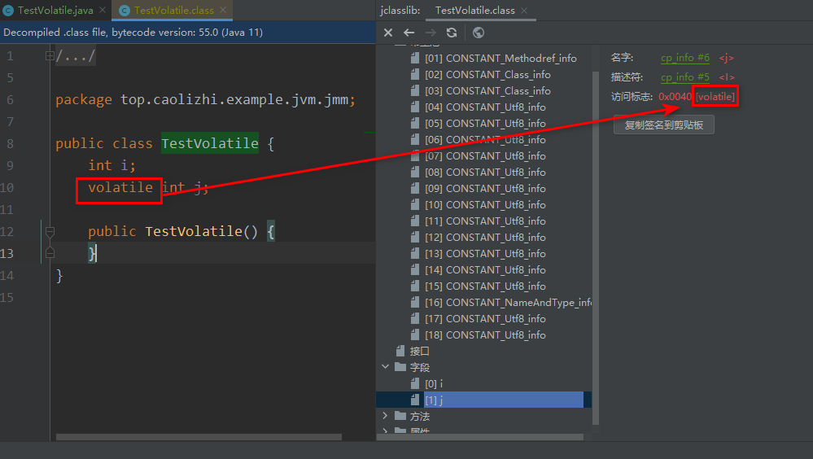
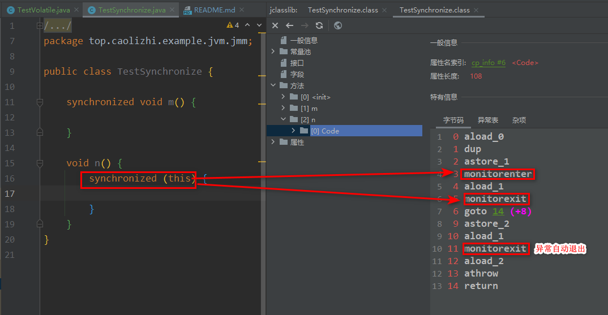
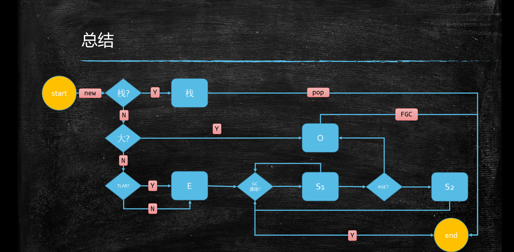

## JVM

### jdk1.8 class 

#### file format


`javap -v Bytecode01.class`

```
classfile {
   u4 magic;
   u2 minor_version;
   u2 major_version;
   u2 constant_pool_count; // 16 个，但是 0 保留，所以只有 15 个
   cp_info constant_pool[constant_pool_count - 1]
   u2
}
```

### JMM

#### volatile 底层实现
1. 字节码层级

2. JVM层级
3. OS和硬件层级

#### synchronized 底层实现
1. 字节码层级

2. JVM层级
3. OS和硬件层级

#### 对象分配过程

